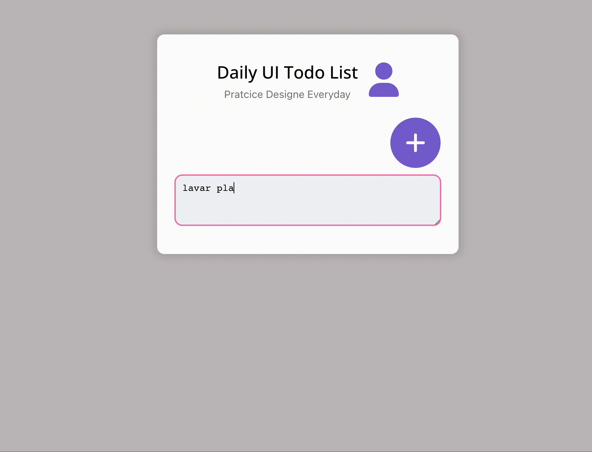

Este To-do list hace parte del reto número 1 de la noche de retos con react.
Se usa useState y props para el manejo de la información y las propiedades de los componentes.
Al ser una aplicación pequeña no se usa Context API o Redux. 

